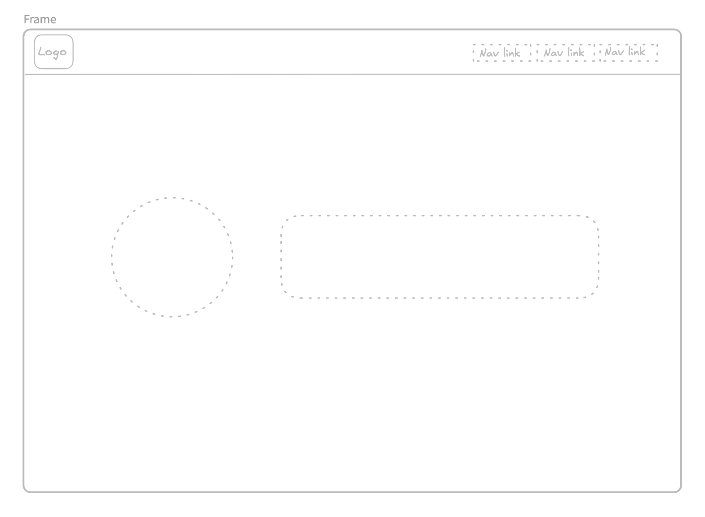
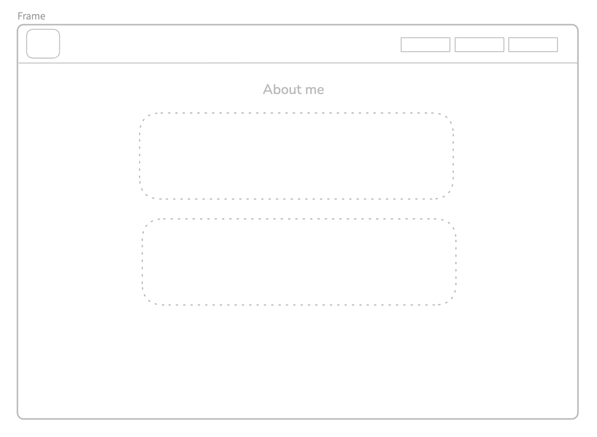
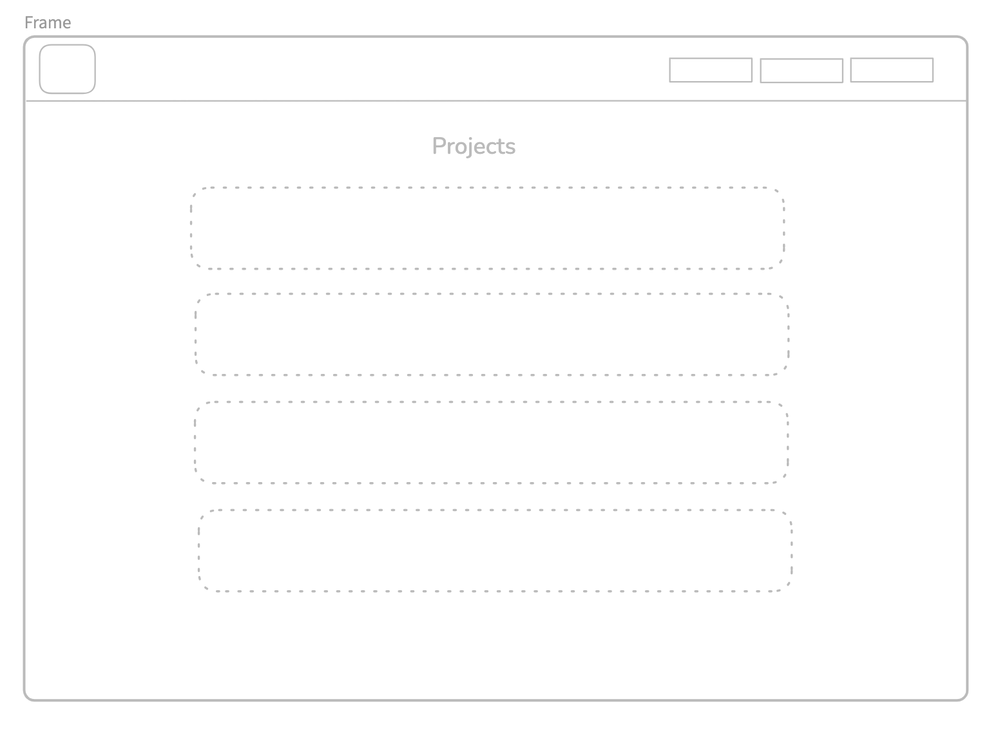
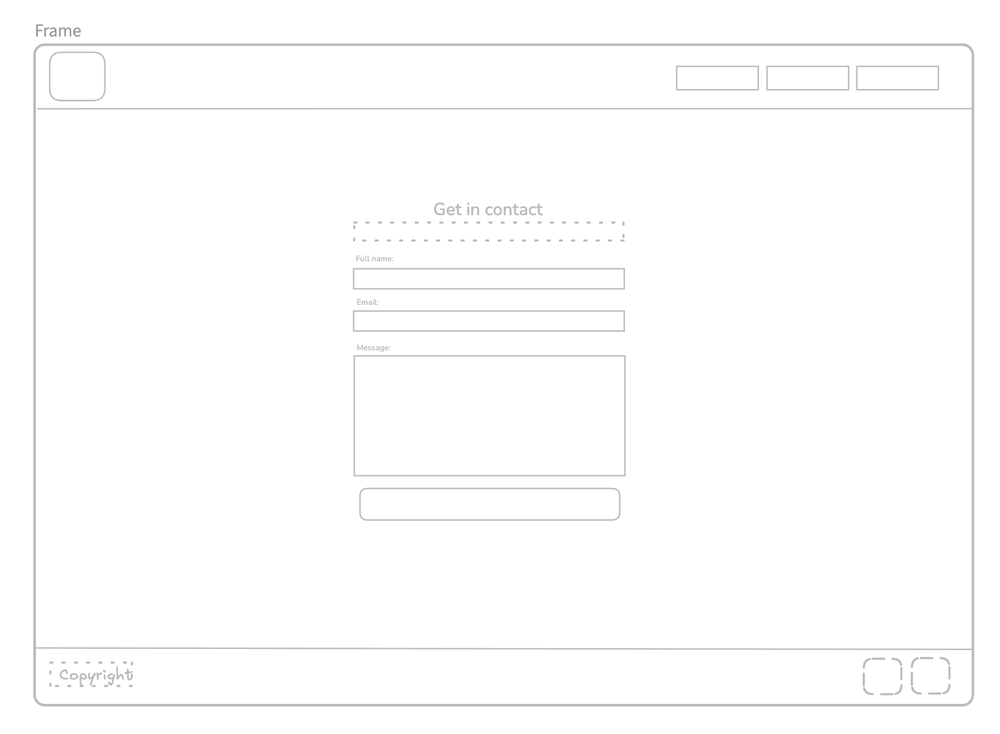
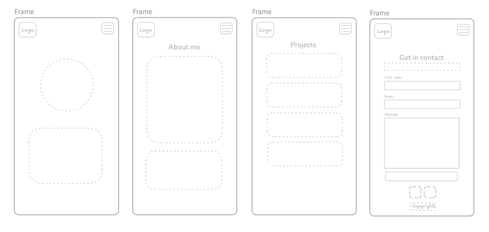
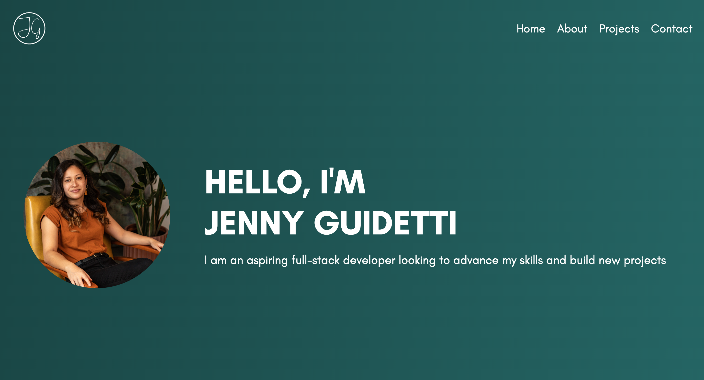

#  Personal Portfolio
​
[Link to Portfolio Site](https://jennyguidetti.github.io/)

This personal portfolio is a website designed using HTML and CSS which contains an overview of myself as developer for potential employers and interested developers. The website is version controlled with Git and deployed on GitHub Pages for viewing. Primarilty semantic HTML tags were used in the code.

### Content
[Wireframes](#Wireframes)  
[Design](#Design)  
[Responsiveness](#Responsiveness)  
[Features](#Features)  

### MVP
These are the main elements of the portfolio
- One profile picture
- Biography (min 100 words)
- Functional contact form
- "Projects" section
- Links to external sites (GitHub, LinkedIn)

### Wireframes
The wireframes were designed in Excalidraw in the initial design phase. The MVP elements were included in the wireframe design. 

#### Wireframes Desktop

#### Wireframes Mobile

### Design
The goal of the design layout was to keep the overall look simple and easy to read. Two fonts (halimun, glacial indifference) and four main colours (#0f2f2f, #1A4645, #266867, F8BC24) were chosen to limit overwhelming the page with different elements. The background is a simple gradient of the two darkest green colours with white text throughout that contrasts well against it. There are four web pages on the site - home, about, projects and contact. There are no defined borders so the header, footer and pages flow into one another. More pages can be easily added without interupting the flow of content. 

The home page has a hero element but each other page has a clear heading to indicate the purpose. This hero element is a simple photo of myself and a basic introductory statement. The about section features a short biography of my experience of coding and known coding languages. The projects section displays previous projects I have made and has space for future projects to be added. The contact page features a simple contact form and footer. The footer includes a copyright and links to my profiles on the external sites GitHub and Linked In.

#### Desktop Pages
Screen size width >768px

### Responsiveness
The website has been designed with mobile and desktop screen sizes in mind however works best for desktop and laptop screens. 768px was used to differentiate between screen sizes. The mobile design response success depends on the screen size of the device, appearing better on larger phones. Further tweaks need to be included to account for smaller phone screens and tablets.

#### Mobile Pages
Screen size width <768px

### Features
Button States
The submit button on the contact form has subtle styling for active and hover states. 

#### Submit Button States

### Future Improvements
- Making the contact page usable
